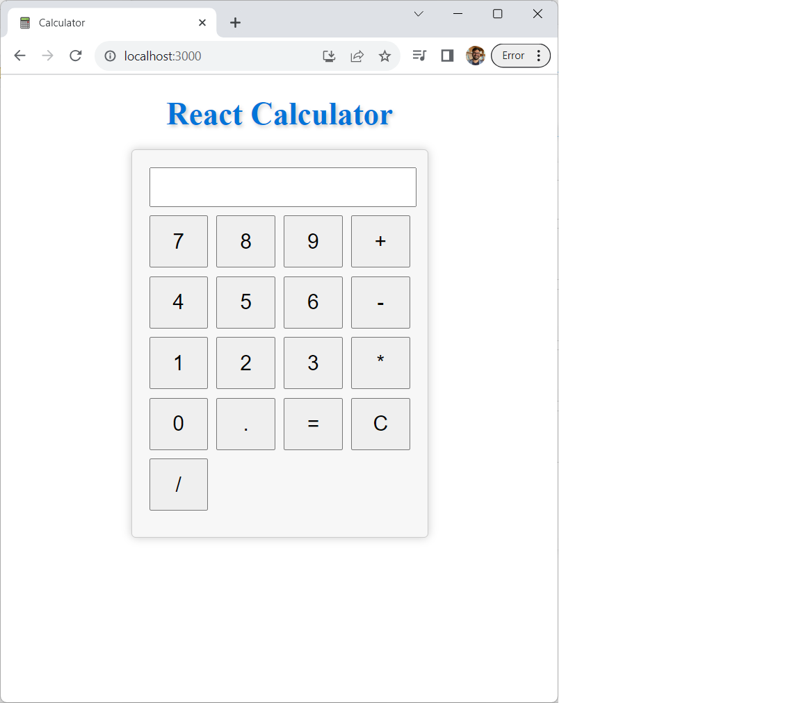

# React Calculator App

This is a simple calculator application built with React for the front-end and Python Flask for the back-end. It allows users to perform basic arithmetic operations such as addition, subtraction, multiplication, and division.



## Features

- Addition
- Subtraction
- Multiplication
- Division

## Getting Started

Follow the instructions below to set up and run the calculator application on your local machine.

### Prerequisites

- Node.js and npm installed
- Python installed (for the Flask back-end)

### Installation

1. Clone the repository:

   ```
   git clone https://github.com/bhanu-code-repo/react-with-python.git
   cd 01-calculator
   ```
### Running the Application
1. Start the React front-end:
   ```
   cd frontend
   npm start
   ```
2. In a separate terminal, start the Python Flask back-end:
   ```
   cd backend
   python app.py
   ```
The calculator application should be accessible at http://localhost:3000. You can perform basic arithmetic operations using the calculator.

### Customization
You can customize the application further by:

* Adding more advanced mathematical operations.
* Enhancing the user interface with additional styling.
* Implementing memory functions (e.g., save and recall previous calculations).

## Connect and Subscribe

Thank you for using the React Calculator App! If you find this project helpful or interesting, consider connecting with me on LinkedIn and subscribing to my YouTube channel for more programming content and tutorials.

- **LinkedIn:** [Your LinkedIn Profile](https://www.linkedin.com/in/bpst)
- **YouTube Channel:** [Your YouTube Channel](https://www.youtube.com/@codecraftingcentral)

Your support and feedback are greatly appreciated. Feel free to reach out if you have any questions, suggestions, or if you'd like to collaborate on future projects. I'm always excited to connect with fellow developers and learners.

Let's stay connected and keep learning together!

## Acknowledgments
This project was created for educational purposes and as a demonstration of a simple full-stack application.

Special thanks to the React and Flask communities for their excellent documentation and support.

Happy calculating!


