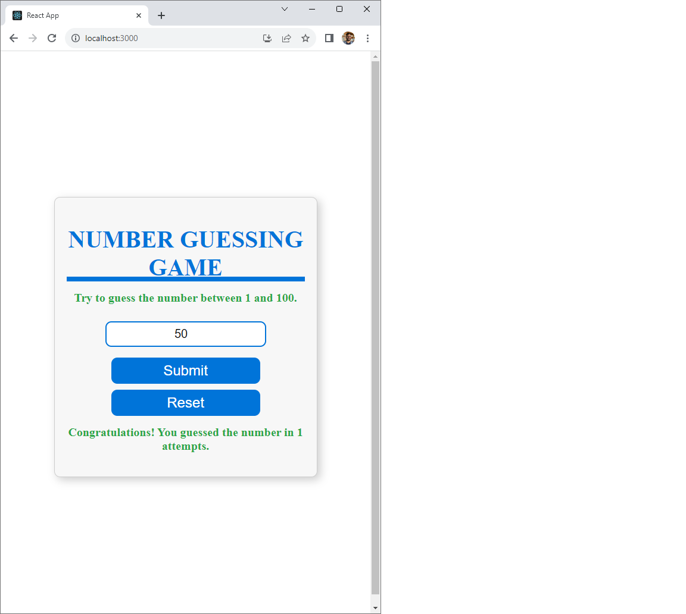

# Number Guessing Game

Welcome to the Number Guessing Game project! This is a simple yet fun game that challenges players to guess a randomly generated number between 1 and 100.



## Features

- Guess a number between 1 and 100.
- Receive feedback on whether your guess is too high, too low, or correct.
- Keep track of the number of attempts it takes to guess the correct number.
- Reset the game and generate a new random number.

## Getting Started

To play the Number Guessing Game on your local machine, follow these instructions:

### Prerequisites

- Node.js and npm installed for the React front-end.
- Python installed for the Flask back-end.

### Installation

1. Clone the repository:

   ```
   git clone https://github.com/bhanu-code-repo/react-with-python.git
   cd guess-number
   ```
2. Set up the React front-end:
   ```
   cd frontend
   npm install
   ```
   
3. Set up the Python Flask back-end (in a separate terminal):
   ```
   cd backend
   pip install -r requirements.txt
   ```
   
### Running the Application
1. Start the React front-end:
   ```
   cd frontend
   npm start
   ```

2. In a separate terminal, start the Python Flask back-end:
  ```
  cd backend
  python app.py
  ```
The Number Guessing Game should be accessible at http://localhost:3000. Enjoy the game!

## Customization
You can customize the game by:

* Modifying the range of numbers to guess.
* Adding new features, such as high-score tracking.
* Enhancing the user interface and styling.
